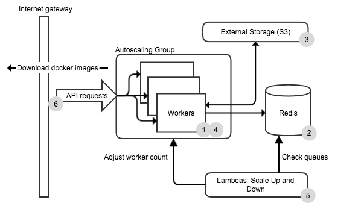
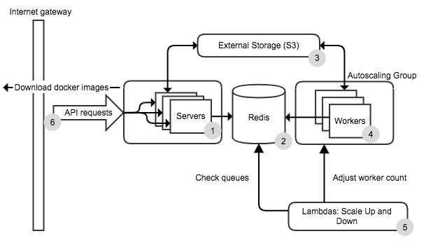

# Architecture and application design

Walkthrough:

API request [[1]](#1-api-gateway) arrives.  The request is passed to one of the servers [[2]](#2-api-request-servers). Assuming the request is a job submission, the job is registered with the redis db [[3]](#3-redis-database), and the inputs are copied to external storage [[4]](#4-external-storage)[[&ast;]](#persisted-and-fast-jobs), and the job is then put on the queue. A worker [[5]](#5-workers) will then take the job off the queue, create a docker container to run the job, copy inputs[[&ast;]](#persisted-and-fast-jobs), execute the container. When the job is finished, outputs[[&ast;]](#persisted-and-fast-jobs) are copied to external storage [[4]](#4-external-storage), and the job is finished and removed from the queue.

In the background, lambdas [[6]](#6-scaling-lambdas) monitor the workers and the queue, and will scale up/down as appropriate.

## 1. API Gateway

The CCC stack does not have any access control itself, so it is the responsibility of the person deploying CCC to control access.

## 2. API request servers

By default, there is no difference between servers that process API requests, and workers that process jobs, the same server process handles both.

However, if the env var `DISABLE_WORKER=true` is passed to the server process, then processing jobs is disabled. This reduces the attack surface of the stack as the docker daemon is not mounted by servers. Servers and workers do not interact directly, they both communicate via [redis](#3-redis-database).

This would mean you need auto-scaling groups: one for the servers, and one for the workers:

### Persisted and fast jobs

There are two types of jobs

 1. Standard jobs, where inputs and outputs are copied to external storage. These jobs can be long running. A submission request is returned immediately with the job id, this is used to query the job status via HTTP requests or a websocket.
 2. Fast jobs. External storage is ignored, inputs are copied into Redis (so cannot be huge), and the jobs are ahead of standard jobs in the queue. The request response is returned when the job is complete. Since there is no durability of inputs/outputs, if a job fails, the querying application should retry.

## 3. Redis database

Stores:

	- queues
	- jobs
	- job inputs/outputs
	- worker health status
	- job statistics

It contains the state of the application, and if it goes down, the stack will not work.

## 4. External storage

E.g. S3. Job inputs and outputs are stored here.

## 5. Workers

A worker consists of simply a machine with docker installed. The worker process runs as a privileged docker container that listens to the redis queue. When a job is taken off the queue, a container is spun up, inputs copied, docker container is executed, outputs copied, and the queue is notified the job is complete.

## 6. Scaling lambdas

Because the Autoscaling group control of scaling lacks the ability to look at the redis queue, AWS lambdas periodically check the redis queue, and adjust workers up or down depending on various factors (queue size/state, time workers have been up, worker health).